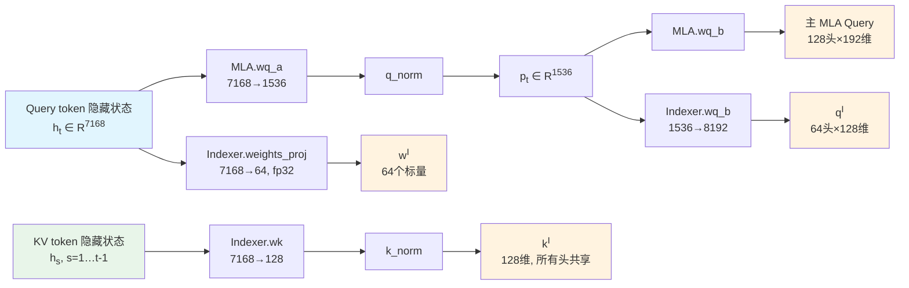
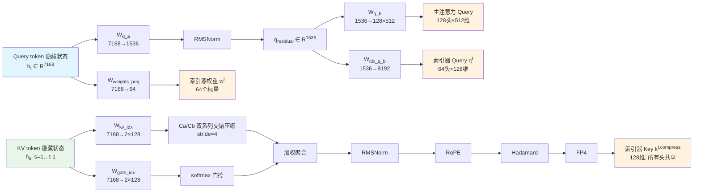

## Deepseek v2-v3：MLA

### 问题来源：MHA 的 kv cache 占用

对于标准的**Multi-Head Attention (MHA)**，即每个注意力头都拥有独立的 Key 和 Value 投影，其 KV Cache 大小为：

$$
\text{KV Cache 大小} = 2 \times L \times S \times N_h \times d_h \times B_{\text{bytes}}
$$

其中：

- $ L $：Transformer 的层数
- $ S $：已缓存的序列长度（在自回归生成中通常为上下文长度 + 已生成的 token 数）
- $ N_h $：注意力头的数量（在标准 MHA 中，Query、Key、Value 的头数均相等）
- $ d_h $：每个注意力头的维度
- $ B\_{\text{bytes}} $：存储精度的字节数
- 因子 $ 2 $：代表 Key 和 Value 各需一份缓存

以 DeepSeek-V3 为例，层数 $L = 61$，注意力头数 $N_h = 128$，每头 KV 维度 $d_h = 128$，使用 bf16 精度（$B_{\text{bytes}} = 2$）。如果使用标准 MHA，在存储 1M token 时，KV Cache 大小为：

$$
2 \times 61 \times 10^6 \times 128 \times 128 \times 2 \text{ bytes} \approx 4.0 \text{ TB}
$$

这个数字对于实际部署来说完全不可接受。在 DeepSeek-V2 之前，业界主要通过 MQA（Multi-Query Attention）和 GQA（Grouped-Query Attention）来降低 KV Cache 开销——它们的核心思路是减少 Key/Value 头的数量 $N_h^{KV}$，让多个 Query 头共享同一组 Key 和 Value。例如 GQA-8 将 $N_h^{KV}$ 从 128 降到 8，获得 16 倍的 Cache 压缩；MQA 将 $N_h^{KV}$ 降到 1，获得 128 倍压缩。

然而，这类方法的本质是**有损压缩**：减少 KV 头数意味着不同 Query 头不再拥有独立的 Key 和 Value 表示，必然会丢失一部分头间多样性（head diversity），导致模型在复杂推理任务上的性能下降。实践中，GQA 的质量损失虽然可控但确实存在；MQA 的质量损失则更为显著。DeepSeek 团队希望找到一种方案，既能实现与 GQA 相当甚至更好的 Cache 压缩率，又能在模型质量上完全不逊于 MHA。

### 算法原理：低秩压缩

Deepseek v2 的核心观察是：MHA 中 Key 和 Value 向量虽然维度很高（128头 × 128 维），但它们携带的有效信息可能集中在一个低维子空间中。如果能够学习一个低秩投影，将高维 KV 压缩到一个低维的"潜在表示"（latent representation）中存储，缓存后再通过上投影恢复为每个头的高维 KV，就能在**不减少注意力头数**的前提下大幅降低缓存开销。从这个想法出发，Deepseek 团队带来了 MLA（Multi-Head Latent Attention）：

<figure style="text-align: center;">
    
    <figcaption>MLA 架构图</figcaption>
</figure>

#### 详细计算过程

**(i) 计算 KV**

input $\mathbf{h}_t \in \mathbb{R}^d$ 通过下投影得到压缩 latent：

$$
\mathbf{c}_t^{KV} = W^{DKV} \mathbf{h}_t \in \mathbb{R}^{d_c}
$$

在 DeepSeek-V3 中：$d = 7168$，$d_c = 512$

通过上投影 $W^{UK}$ 和 $W^{UV} \in \mathbb{R}^{d_c \times d}$ 将 KV 维度扩展回 $d$（其中 $d = d_h \times n_h$）：

$$
\mathbf{K}_t^c = W^{UK} \mathbf{c}_t^{KV} \in \mathbb{R}^d \quad \Longrightarrow \quad \mathbf{K}_t^c = [\mathbf{K}_{t,1}^c ; \mathbf{K}_{t,2}^c ; \cdots ; \mathbf{K}_{t,n_h}^c]
$$

$$
\mathbf{V}_t^c = W^{UV} \mathbf{c}_t^{KV} \in \mathbb{R}^d \quad \Longrightarrow \quad \mathbf{V}_t^c = [\mathbf{V}_{t,1}^c ; \mathbf{V}_{t,2}^c ; \cdots ; \mathbf{V}_{t,n_h}^c]
$$

**(ii) 计算 Q**

input $\mathbf{h}_t \in \mathbb{R}^d$ 通过下投影得到 Query latent：

$$
\mathbf{c}_t^Q = W^{DQ} \mathbf{h}_t \in \mathbb{R}^{d_q}
$$

并通过 $W^{UQ} \in \mathbb{R}^{d_q \times d}$ 上投影扩展：

$$
\mathbf{q}_t^c = W^{UQ} \mathbf{c}_t^Q \in \mathbb{R}^d \quad \Longrightarrow \quad \mathbf{q}_t^c = [\mathbf{q}_{t,1}^c ; \mathbf{q}_{t,2}^c ; \cdots ; \mathbf{q}_{t,n_h}^c]
$$

**(iii) Q、K 增加 RoPE 位置编码部分**

为了支持位置信息，引入额外的 RoPE 分量：

$$
\mathbf{k}_t^R = \text{RoPE}(W^{KR}\mathbf{h}_t) \in \mathbb{R}^{d_h^R}, \quad W^{KR} \in \mathbb{R}^{d \times d_h^R}
$$

$$
\mathbf{q}_t^R = \text{RoPE}(W^{QR}\mathbf{c}_t^Q) \in \mathbb{R}^{d_h^R \cdot n_h}, \quad W^{QR} \in \mathbb{R}^{d_q \times d_h^R \cdot n_h}, \quad \mathbf{q}_t^R = [\mathbf{q}_{t,1}^R ; \mathbf{q}_{t,2}^R ; \cdots ; \mathbf{q}_{t,n_h}^R]
$$

与之前的 $\mathbf{q}_t^c$、$\mathbf{k}_t^c$ 拼接：

$$
\mathbf{q}_{t,i} = [\mathbf{q}_{t,i}^c ; \mathbf{q}_{t,i}^R] \in \mathbb{R}^{d_h + d_h^R}, \quad \mathbf{k}_{t,i} = [\mathbf{k}_{t,i}^c ; \mathbf{k}_t^R] \in \mathbb{R}^{d_h + d_h^R}
$$

> （$c$ 相当于是内容信息，$R$ 相当于位置信息）

**(iv) 注意力输出计算**

$$
\Rightarrow O_{t,i} = \sum_{j=1}^{S} \text{Softmax}_j\left(\frac{\mathbf{q}_{t,i}^\top \mathbf{k}_{j,i}}{\sqrt{d_h + d_h^R}}\right) \mathbf{V}_{j,i}^c
$$

$$
u_t = W^O [O_{t,1} ; O_{t,2} ; \cdots ; O_{t,n_h}], \quad W^O \in \mathbb{R}^{d \times d}
$$

注意到 MLA 的 RoPE 与传统的直接作用在 Q、K 上的 RoPE 不一样：MLA 使用了**解耦式 RoPE（Decoupled RoPE）**。这是因为传统的 RoPE 与 MLA 的 KV 缓存不兼容。

**Case a：不加 RoPE**

若不加 RoPE，我们可以将 Q 的上投影吸收进 K 的上投影中：

$$
\mathbf{q}_{t,i}^\top \mathbf{k}_{j,i} = (W_{(i)}^{UQ} \mathbf{c}_t^Q)^\top (W_{(i)}^{UK} \mathbf{c}_j^{KV}) = (\mathbf{c}_t^Q)^\top (\underbrace{(W_{(i)}^{UQ})^\top W_{(i)}^{UK}}_{\text{可预计算}}) \mathbf{c}_j^{KV}
$$

⇒ 可以**提前计算** $(W_{(i)}^{UQ})^\top W_{(i)}^{UK}$ ⇒ **缓存** $\mathbf{c}_j^{KV}$ 而不是 $W_{(i)}^{UK} \mathbf{c}_j^{KV}$，从而大幅节省 **KV cache**。

**Case b：增加 RoPE（直接方式）**

假设我们直接在 $\mathbf{k}_t^c$、$\mathbf{q}_t^c$ 上应用 RoPE：

$$
\mathbf{q}_{t,i}^\top \mathbf{k}_{j,i} = (R_t W_{(i)}^{UQ} \mathbf{c}_t^Q)^\top (R_j W_{(i)}^{UK} \mathbf{c}_j^{KV}) = (\mathbf{c}_t^Q)^\top \underbrace{(W_{(i)}^{UQ})^\top R_j^\top R_j (W_{(i)}^{UK})}_{\text{这个不再是固定矩阵！}} \mathbf{c}_j^{KV}
$$

⇒ **不能提前计算** ⇒ **RoPE 与低秩缓存不兼容**

**Case c：解决方案 — 增加一个很小的 q、k 分量，引入 RoPE**

在一个很小的维度下（$\frac{d_h}{2} = 64$），用 MQA 的方式计算 q、k：

$$
\mathbf{q}_{t,i}^\top \mathbf{k}_{j,i} = [\mathbf{q}_{t,i}^c ; \mathbf{q}_{t,i}^R]^\top [\mathbf{k}_{j,i}^c ; \mathbf{k}_t^R] = \underbrace{\mathbf{q}_{t,i}^c{}^\top \mathbf{k}_{j,i}^c}_{\text{cache } \mathbf{c}_t^{KV} \in \mathbb{R}^{512}} + \underbrace{\mathbf{q}_{t,i}^R{}^\top \mathbf{k}_t^R}_{\text{cache } \mathbf{k}_t^R \in \mathbb{R}^{64}}
$$

此时，MLA 的 KV Cache 大小为：

$$
\text{KV Cache} = \text{Batch Size} \times \text{Seq Length} \times \underbrace{(d_c + d_R)}_{512 + 64 = 576} \times \text{Layers} \times \text{Bytes}
$$

> 直觉：解耦式 RoPE 为什么可以选择一个非常小的维度？位置信息本质上是一个结构极其简单、信息密度低的信号。对于一个token，我们只需要知道它在序列中的相对位置（远近）。这种低复杂度使得少量的维度（如64维）就足以编码清晰的相对位置关系。

#### 推理时的计算过程

**(i) 预计算阶段（离线准备）**

在 input 侧，对于每个头 $i$，预先计算好吸收矩阵（无需每次推理都重新计算）：

由于 $\mathbf{q}_{t,i}^\top \mathbf{k}_{j,i} = (W_{(i)}^{UQ} \mathbf{c}_t^Q)^\top (W_{(i)}^{UK} \mathbf{c}_j^{KV}) = (\mathbf{c}_t^Q)^\top \underbrace{(W_{(i)}^{UQ})^\top W_{(i)}^{UK}}_{M_{\text{absorbed}(i)}} \mathbf{c}_j^{KV}$

⇒ 定义 $M_{\text{absorbed}(i)} = (W_{(i)}^{UQ})^\top W_{(i)}^{UK} \in \mathbb{R}^{d_q \times d_c}$

对于 Output 侧：

$$
\mathbf{c}_t^{KV} \in \mathbb{R}^{d_c} \xrightarrow{W^{UV}} \mathbf{V}_t^c \in \mathbb{R}^{d \cdot n_h \cdot d_h}, \quad \mathbf{V}_t^c = [\mathbf{V}_{t,1}^c ; \cdots ; \mathbf{V}_{t,n_h}^c], \quad \mathbf{V}_{t,i}^c \in \mathbb{R}^{d_h}
$$

$$
\text{Output}^{(i)} = W_i^O \left(\sum_j a_{t,j}^{(i)} \cdot \mathbf{V}_j^{(i)}\right) = W_i^O \left(\sum_j a_{t,j}^{(i)} \cdot (W_i^{UV} \cdot \mathbf{c}_j^{KV})\right) = \underbrace{W_i^O W_i^{UV}}_{M_{\text{out}(i)}} \left(\sum_j a_{t,j}^{(i)} \mathbf{c}_j^{KV}\right)
$$

⇒ 同样定义 $M_{\text{out}(i)} = W_i^O \cdot W_i^{UV} \in \mathbb{R}^{d \times d_c}$

**在推理时，不再加载 $W^{UQ}$、$W^{UK}$，$W_i^O$，$W_i^{UV}$，而是加载 $M_{\text{absorbed}}$ 与 $M_{\text{out}}$。**

**(ii) 在线计算阶段（解码时，input：第 t 个 token 的 h_t）**

**Step 1：生成并存储 KV Cache**

$$
\mathbf{c}_t^{KV} = W^{DKV} \mathbf{h}_t \in \mathbb{R}^{d_c}, \quad \mathbf{k}_t^R = \text{RoPE}(W^{KR}\mathbf{h}_t) \in \mathbb{R}^{d_h^R}
$$

**Step 2：生成 query**

$$
\mathbf{c}_t^Q = W^{DQ} \mathbf{h}_t \in \mathbb{R}^{d_q}, \quad \mathbf{q}_t^R = \text{RoPE}(W^{QR}\mathbf{h}_t) \in \mathbb{R}^{d_q^R}
$$

计算第 i 个 attention head 的 absorbed query：

$$
\mathbf{q}_{\text{absorbed}}^{(i)} = (M_{\text{absorbed}(i)})^\top \mathbf{c}_t^Q \in \mathbb{R}^{d_c}
$$

**Step 3：计算 attention**

- Content 分量：$\text{Score}_c^{(i)} = (\mathbf{q}_{\text{absorbed}}^{(i)})^\top \mathbf{c}_j^{KV} \in \mathbb{R}$
- RoPE 分量：$\text{Score}_R^{(i)} = (\mathbf{q}_{t,i}^R)^\top \mathbf{k}_j^R \in \mathbb{R}$

$$
\Rightarrow a_{t,j}^{(i)} = \text{Softmax}\left(\text{Score}_c^{(i)} + \text{Score}_R^{(i)}\right)
$$

**Step 4：Output Projection**

$$
u_t^{(i)} = \sum_j a_{t,j}^{(i)} \cdot \mathbf{c}_j^{KV}, \quad u_t = [u_t^{(1)} ; u_t^{(2)} ; \cdots ; u_t^{(n_h)}]
$$

$$
O_t = \sum_{i=1}^{n_h} M_{\text{out}(i)} \cdot u_t^{(i)}
$$

### KV Cache 对比

| 机制      | 每 token 每层存储量                  | V3（61 层）1M token | vs MHA 压缩比 |
| --------- | ------------------------------------ | ------------------- | ------------- |
| **MHA**   | $2 \times 128 \times 128 = 32{,}768$ | ~4.0 TB             | 1×            |
| **GQA-8** | $2 \times 8 \times 128 = 2{,}048$    | ~250 GB             | 16×           |
| **MQA**   | $2 \times 128 = 256$                 | ~31 GB              | 128×          |
| **MLA**   | $512 + 64 = 576$                     | **~70 GB**          | **~57×**      |

MLA 以约 57 倍的压缩比实现了与 MHA 相当甚至更优的模型质量。其质量优势来源于：低秩压缩起到了正则化（regularization）的作用，引导模型将 KV 信息集中到更紧凑的表示中，反而减少了对噪声的过拟合。

### MLA 伪代码

```python
# ============ MLA (Multi-Head Latent Attention) ============

import torch
import torch.nn as nn
import math

class MLA(nn.Module):
    """
    Multi-Head Latent Attention 完整实现

    核心思想：Cache 低维 Latent Space 变量代替高维 K、V，从而 ↓ KV-cache

    参数配置（DeepSeek-V3）:
        d_model = 7168       # 模型隐藏维度
        n_heads = 128        # 注意力头数
        d_q = 1536           # Query 压缩秩 (q_lora_rank)
        d_c = 512            # KV 压缩秩 (kv_lora_rank)
        d_h = 128            # 每头内容维度 (qk_nope_head_dim)
        d_hR = 64            # 每头 RoPE 维度 (qk_rope_head_dim)
        d_v = 128            # 每头 Value 维度 (v_head_dim)
    """

    def __init__(self, d_model=7168, n_heads=128, d_q=1536, d_c=512, d_h=128, d_hR=64, d_v=128):
        super().__init__()

        self.d_model = d_model
        self.n_heads = n_heads
        self.d_q = d_q          # Query latent 维度
        self.d_c = d_c          # KV latent 维度
        self.d_h = d_h          # 每头 content 维度
        self.d_hR = d_hR        # 每头 RoPE 维度
        self.d_v = d_v          # 每头 Value 维度

        # ========== 投影矩阵定义 ==========

        # (ii) KV 路径
        self.W_DKV = nn.Linear(d_model, d_c, bias=False)      # 下投影: h -> c^KV
        self.W_UK = nn.Linear(d_c, n_heads * d_h, bias=False) # 上投影: c^KV -> K (每头)
        self.W_UV = nn.Linear(d_c, n_heads * d_v, bias=False) # 上投影: c^KV -> V (每头)
        self.W_KR = nn.Linear(d_model, d_hR, bias=False)      # RoPE Key 投影: h -> k^R

        # (iii) Q 路径
        self.W_DQ = nn.Linear(d_model, d_q, bias=False)       # 下投影: h -> c^Q
        self.W_UQ = nn.Linear(d_q, n_heads * d_h, bias=False) # 上投影: c^Q -> q (每头)
        self.W_QR = nn.Linear(d_q, n_heads * d_hR, bias=False)# RoPE Query 投影: c^Q -> q^R

        # Output 投影
        self.W_O = nn.Linear(n_heads * d_v, d_model, bias=False)

        # 归一化层
        self.q_norm = nn.RMSNorm(d_q)
        self.kv_norm = nn.LayerNorm(d_c)

        # ========== 预计算吸收矩阵（离线/初始化时计算）==========
        # M_absorbed[i] = (W_UQ_i)^T @ W_UK_i  ∈ R^{d_q × d_c}
        # 推理时不再加载 W_UQ、W_UK，而是加载 M_absorbed
        W_UQ_per_head = self.W_UQ.weight.view(n_heads, d_q, d_h)     # (n_heads, d_q, d_h)
        W_UK_per_head = self.W_UK.weight.view(n_heads, d_c, d_h)     # (n_heads, d_c, d_h)
        self.M_absorbed = torch.einsum('hqi,hci->hqc', W_UQ_per_head, W_UK_per_head)  # (n_heads, d_q, d_c)

        # M_out[i] = W_O_i @ W_UV_i  ∈ R^{d_model × d_c}
        # 推理时合并输出投影
        W_O_per_head = self.W_O.weight.view(d_model, n_heads, d_v)   # (d_model, n_heads, d_v)
        W_UV_per_head = self.W_UV.weight.view(n_heads, d_c, d_v)    # (n_heads, d_c, d_v)
        self.M_out = torch.einsum('oih,hcv->ohc', W_O_per_head, W_UV_per_head)  # (n_heads, d_model, d_c)

    def forward(self, h_t, kv_cache, pe_cache, freqs_cis):
        """
        在线计算阶段（解码时，input: 第 t 个 token 的 h_t）

        参数:
            h_t: (B, 1, d_model) — 当前 token 的隐藏状态
            kv_cache: (B, S_cached, d_c) — 已缓存的压缩 KV 内容向量 c^KV
            pe_cache: (B, S_cached, d_hR) — 已缓存的 RoPE Key 向量 k^R
            freqs_cis: 当前位置的 RoPE 复数频率

        返回:
            output: (B, 1, d_model) — 注意力输出
            kv_cache: 更新后的 KV cache
            pe_cache: 更新后的 RoPE cache
        """
        B = h_t.shape[0]
        S_cached = kv_cache.shape[1]

        # ================================================================
        # Step 1: 生成并存储 KV Cache
        # ================================================================

        # c_t^KV = W_DKV @ h_t  ∈ R^{d_c}
        c_kv = self.W_DKV(h_t)                    # (B, 1, d_c)

        # k_t^R = Rope(W_KR @ h_t)  ∈ R^{d_hR}
        k_rope = apply_rotary_emb(self.W_KR(h_t), freqs_cis)  # (B, 1, d_hR)

        # 更新缓存（追加当前 token 的压缩表示）
        kv_cache = torch.cat([kv_cache, c_kv], dim=1)     # (B, S, d_c), S = S_cached + 1
        pe_cache = torch.cat([pe_cache, k_rope], dim=1)   # (B, S, d_hR)

        # ================================================================
        # Step 2: 生成 Query
        # ================================================================

        # c_t^Q = W_DQ @ h_t  ∈ R^{d_q} （下投影 + 归一化）
        c_q = self.q_norm(self.W_DQ(h_t))         # (B, 1, d_q)

        # q_t^R = Rope(W_QR @ c_t^Q)  ∈ R^{n_heads × d_hR}
        q_rope = apply_rotary_emb(
            self.W_QR(c_q).view(B, 1, self.n_heads, self.d_hR),
            freqs_cis
        )                                           # (B, 1, n_heads, d_hR)

        # 计算第 i 个 attention head 的 absorbed query:
        # q_absorbed^(i) = (M_absorbed(i))^T @ c_t^Q  ∈ R^{d_c}
        # 使用预计算的吸收矩阵，避免在线加载 W_UQ、W_UK
        q_absorbed = torch.einsum('hq,bqd->bqh', self.M_absorbed, c_q)
        # q_absorbed: (B, 1, n_heads, d_c)

        # ================================================================
        # Step 3: 计算 Attention
        # ================================================================

        # Content 分量: Score_c^(i) = (q_absorbed^(i))^T @ c_j^KV  ∈ R
        # 利用吸收模式在低维潜在空间直接计算
        content_scores = torch.einsum('bhqc,bSc->bhqS', q_absorbed, kv_cache)
        # content_scores: (B, 1, n_heads, S)

        # RoPE 分量: Score_R^(i) = (q_t,i^R)^T @ k_j^R  ∈ R
        rope_scores = torch.einsum('bhqr,bSr->bhqS', q_rope, pe_cache)
        # rope_scores: (B, 1, n_heads, S)

        # 合并得分并缩放
        scale = math.sqrt(self.d_h + self.d_hR)  # sqrt(192)
        scores = (content_scores + rope_scores) / scale

        # Softmax 得到注意力权重
        attn_weights = torch.softmax(scores, dim=-1)  # (B, 1, n_heads, S)

        # ================================================================
        # Step 4: Output Projection
        # ================================================================

        # 在潜在空间中加权求和:
        # u_t^(i) = Σ_j a_{t,j}^(i) · c_j^KV  ∈ R^{d_c}
        u_t = torch.einsum('bhqS,bSc->bqh', attn_weights, kv_cache)
        # u_t: (B, 1, n_heads, d_c)

        # O_t = Σ_{i=1}^{n_h} M_out(i) · u_t^(i)
        # 使用预计算的 M_out 矩阵，避免在线加载 W_O 和 W_UV
        output = torch.einsum('hdc,bhqc->bqd', self.M_out, u_t)
        # output: (B, 1, d_model)

        return output, kv_cache, pe_cache


def apply_rotary_emb(x, freqs_cis):
    """
    应用 RoPE (Rotary Position Embedding)

    参数:
        x: 输入张量
        freqs_cis: 复数频率 (cosθ + i·sinθ)
    """
    # 将 x 拆分为两半，分别乘以 cos 和 sin
    x_ = torch.float32(x)
    x_complex = torch.view_as_complex(x_.reshape(*x.shape[:-1], -1, 2))
    freqs_complex = torch.view_as_complex(freqs_cis.float())
    x_rotated = torch.view_as_real(x_complex * freqs_complex).flatten(-2)
    return x_rotated.type_as(x)


# ================================================================
# 预计算阶段（离线 / 模型初始化时执行一次）
# ================================================================

def precompute_mla_matrices(model):
    """
    离线预计算吸收矩阵和输出矩阵

    这个函数只在模型初始化或导出时调用一次，
    推理引擎将使用这些预计算的矩阵替代原始的 W_UQ、W_UK、W_O、W_UV
    """

    print("=== MLA 预计算阶段 ===")

    # 1. 计算 M_absorbed: 吸收矩阵用于 Content Attention
    #    M_absorbed[i] = (W_UQ_i)^T @ W_UK_i  ∈ R^{d_q × d_c}
    W_UQ = model.W_UQ.weight  # (n_heads*d_h, d_q)
    W_UK = model.W_UK.weight  # (n_heads*d_h, d_c)

    W_UQ_heads = W_UQ.view(model.n_heads, model.d_q, model.d_h)  # (n_heads, d_q, d_h)
    W_UK_heads = W_UK.view(model.n_heads, model.d_c, model.d_h)  # (n_heads, d_c, d_h)

    M_absorbed = torch.matmul(W_UQ_heads.transpose(1, 2), W_UK_heads)
    # M_absorbed: (n_heads, d_h, d_c)
    print(f"  ✓ M_absorbed computed: {M_absorbed.shape}")
    print(f"    推理时不再加载 W_UQ ({W_UQ.shape}) 和 W_UK ({W_UK.shape})")
    print(f"    改为加载 M_absorbed ({M_absorbed.shape})")

    # 2. 计算 M_out: 输出投影合并矩阵
    #    M_out[i] = W_O_i @ W_UV_i  ∈ R^{d_model × d_c}
    W_O = model.W_O.weight  # (d_model, n_heads*d_v)
    W_UV = model.W_UV.weight  # (n_heads*d_v, d_c)

    W_O_heads = W_O.view(model.d_model, model.n_heads, model.d_v)  # (d_model, n_heads, d_v)
    W_UV_heads = W_UV.view(model.n_heads, model.d_c, model.d_v)   # (n_heads, d_c, d_v)

    M_out = torch.matmul(W_O_heads, W_UV_heads.transpose(1, 2))
    # M_out: (n_heads, d_model, d_c)
    print(f"  ✓ M_out computed: {M_out.shape}")
    print(f"    推理时不再加载 W_O ({W_O.shape}) 和 W_UV ({W_UV.shape})")
    print(f"    改为加载 M_out ({M_out.shape})")

    # 3. 统计 KV Cache 大小
    d_c = model.d_c        # 512
    d_hR = model.d_hR      # 64
    layers = 61            # DeepSeek-V3 层数
    bytes_per_token = (d_c + d_hR) * 2  # bf16 = 2 bytes

    print(f"\n=== KV Cache 大小统计 ===")
    print(f"  每 token 每层缓存维度: {d_c} (content) + {d_hR} (RoPE) = {d_c + d_hR}")
    print(f"  每 token 每层字节数: {bytes_per_token} bytes (bf16)")
    print(f"  对于 {layers} 层 DeepSeek-V3:")
    print(f"    1M tokens: ~{layers * 10**6 * bytes_per_token / (1024**3):.1f} GB")

    return {
        'M_absorbed': M_absorbed,
        'M_out': M_out,
        'kv_cache_dim': d_c,
        'rope_cache_dim': d_hR,
    }
```

#### 数据流

| 阶段               | 操作                                                                                                                                     | 目的                                                                       |
| ------------------ | ---------------------------------------------------------------------------------------------------------------------------------------- | -------------------------------------------------------------------------- |
| **预计算（离线）** | $M_{\text{absorbed}} = (W^{UQ}_i)^\top W^{UK}_i$                                                                                         | 将 Q/K 上投影合并，推理时无需展开到每头                                    |
| **预计算（离线）** | $M_{\text{out}} = W^O_i \cdot W^{UV}_i$                                                                                                  | 将输出投影与 V 上投影合并                                                  |
| **Step 1（在线）** | $\mathbf{c}_t^{KV} = W^{DKV}\mathbf{h}_t$, $\mathbf{k}_t^R = \text{RoPE}(W^{KR}\mathbf{h}_t)$                                            | 生成并缓存压缩 KV（512+64=576维）                                          |
| **Step 2（在线）** | $\mathbf{c}_t^Q = \text{RMSNorm}(W^{DQ}\mathbf{h}_t)$, $\mathbf{q}_{\text{absorbed}}^{(i)} = M_{\text{absorbed}(i)}^\top \mathbf{c}_t^Q$ | 生成 absorbed query（在低维空间计算）                                      |
| **Step 3（在线）** | $\text{Score} = \text{Score}_c + \text{Score}_R$                                                                                         | Content 分量（cache $\mathbf{c}^{KV}$）+ RoPE 分量（cache $\mathbf{k}^R$） |
| **Step 4（在线）** | $O_t = \sum_i M_{\text{out}(i)} \cdot u_t^{(i)}$                                                                                         | 合并输出投影                                                               |

## Deepseek v3.2：DSA

### 问题来源：注意力计算复杂度仍然是 $O(S^2)$

MLA 成功地将 KV Cache 从 MHA 的 $O(N_h \cdot d_h)$ 压缩到 $O(r)$（$r = \text{kv\_lora\_rank}$），解决了存储瓶颈。然而，标准 Transformer 注意力的计算复杂度仍然是 $O(S^2)$——每个 token 都需要与序列中所有 $S$ 个 token 计算注意力得分。当上下文长度从数万扩展到百万级别时，这个二次复杂度成为新的核心瓶颈。

具体来说，对于 DeepSeek-V3 的配置（61 层，128 头，bf16 精度），在 1M token 上下文下的计算量分析如下：

- **预填充（Prefill）阶段**：每个新 token 需要与所有 $10^6$ 个已有 token 计算注意力，总计算量为 $O(L \times N_h \times d_h \times S^2)$
- **解码（Decode）阶段**：每个新生成的 token 同样需要对全部 $S$ 个历史 token 做注意力，虽然只生成一个 token，但单步延迟随 $S$ 线性增长

此外，在解码阶段，虽然 MLA 已经将每个 token 的缓存压缩到 576 维，但逐 token 读取和计算 $10^6$ 个缓存条目的内存带宽开销依然巨大，成为推理延迟的主要来源。DeepSeek 团队观察到：在长上下文中，对于当前 query token，大部分历史 token 的注意力权重实际上非常小，对最终输出的贡献可以忽略。如果能**预先筛选出最相关的少量 token**，仅对它们执行完整的 MLA 注意力，就能将复杂度从 $O(S^2)$ 降至 $O(S \cdot k)$，其中 $k \ll S$。

### 算法原理：动态稀疏选择

传统的稀疏注意力方案（如 Sparse Transformer、Longformer、StreamingLLM 等）大多采用**静态模式**——通过固定窗口、步长或预定义的稀疏模式来决定哪些 token 参与注意力计算。例如滑动窗口注意力只关注最近的 $w$ 个 token，步长注意力每隔 $\Delta$ 个 token 采样一个。这类方法的局限在于：忽略了不同 query token 对历史信息的不同需求——一个问"文章的主旨是什么"的 token 和一个问"第三段的细节是什么"的 token，需要关注的历史 token 截然不同，但静态模式无法区分。

DSA（DeepSeek Sparse Attention）的核心动机是：**让模型自己学会为每个 query token 动态选择最相关的历史 token**。为此，DeepSeek 设计了一个轻量级的**闪电索引器（Lightning Indexer）**，在执行完整 MLA 注意力之前，先用极低的计算开销对所有历史 token 打分，选出 Top-$k$ 个最相关的 token，然后仅对这 $k$ 个 token 执行标准的 MLA 注意力。

<figure style="text-align: center;">
    
    <figcaption>DSA 架构图</figcaption>
</figure>

这种"先粗筛、再精看"的两阶段设计带来几个关键优势：

1. **动态性**：不同 query token 可以关注序列中不同位置的历史 token，不受固定窗口的限制
2. **全局性**：索引器可以选中任意位置的历史 token（而非仅限于局部窗口），支持对远处关键信息的检索
3. **高效性**：索引器本身极其轻量——使用低维向量、MQA 架构、ReLU 激活和 FP8 精度——使其对完整序列的扫描开销远低于一次完整的 MLA 注意力

### 算法实现

#### DSA 的两阶段架构

DSA 在 MLA 之上叠加了一个两阶段流程：

```
阶段 1（粗筛）：闪电索引器对全部 S 个历史 token 打分 → 选取 Top-k
阶段 2（精看）：标准 MLA 注意力仅对选中的 k 个 token 执行
```

整体公式为：

$$
\mathbf{u}_t = \text{MLA-Attn}\left(\mathbf{h}_t, \{\mathbf{c}_s \mid I_{t,s} \in \text{Top-}k(\mathbf{I}_{t,:})\}\right)
$$

其中 $I_{t,s}$ 是索引器为当前 token $t$ 和历史 token $s$ 计算的相关性得分，$k = 2048$。

#### 闪电索引器的三个输入

闪电索引器需要为每个 query token $t$ 计算其与所有历史 token $s$ 的相关性得分。该过程涉及三个关键输入：

$$
I_{t,s} = \sum_{j=1}^{H^I} w_{t,j}^{I} \cdot \text{ReLU}\left(\mathbf{q}_{t,j}^{I} \cdot \mathbf{k}_s^{I}\right)
$$

其中 $H^I = 64$ 为索引器头数，$d^I = 128$ 为每头维度。

**输入 1：索引器 Query $\mathbf{q}_{t,j}^{I} \in \mathbb{R}^{128}$**

$\mathbf{q}^{I}$ 与主 MLA 的 Query 路径**共享压缩中间态**，但使用独立的上投影矩阵。具体而言：

1. MLA 的下投影（共享）：$\mathbf{p}_t = \text{RMSNorm}(\mathbf{h}_t \cdot W_Q^A) \in \mathbb{R}^{1536}$
2. 索引器独立上投影：$\mathbf{q}_t^{I} = \mathbf{p}_t \cdot W_Q^{B,I} \in \mathbb{R}^{64 \times 128}$，其中 $W_Q^{B,I} \in \mathbb{R}^{1536 \times 8192}$

后处理步骤包括：Partial RoPE（前 64 维施加旋转）、Hadamard 变换（维度混合）、FP8 量化。

**输入 2：学习标量权重 $w_{t,j}^{I} \in \mathbb{R}$**

$w^I$ 从原始隐藏状态**独立投影**，与 MLA 完全无关：

$$
w_t^{I} = \mathbf{h}_t \cdot W_w^{I} \in \mathbb{R}^{64}
$$

其中 $W_w^{I} \in \mathbb{R}^{7168 \times 64}$。$w^I$ 使用 **float32** 精度计算，并经过三项缩放：$\frac{1}{\sqrt{H^I}}$（头数归一化）、FP8 量化缩放因子、$\frac{1}{\sqrt{d^I}}$（维度缩放）。它的作用是一个**逐头门控**（per-head gate），控制每个索引器头对最终得分的贡献大小。

**输入 3：共享 Key $\mathbf{k}_s^{I} \in \mathbb{R}^{128}$**

$\mathbf{k}^I$ 同样从原始隐藏状态**独立投影**，采用 MQA 架构（所有 64 个 Query 头共享同一个 Key）：

$$
\mathbf{k}_s^{I} = \text{LayerNorm}(\mathbf{h}_s \cdot W_K^{I})
$$

其中 $W_K^{I} \in \mathbb{R}^{7168 \times 128}$。后处理与 Query 类似：Partial RoPE、Hadamard 变换、FP8 量化后存入索引器专用的 KV Cache。

#### 索引器专用 KV Cache

索引器维护一套与主 MLA 完全独立的 KV Cache，仅存储 Key（不需要 Value）：

| 缓存项                    | 维度 | 精度 | 每 token 字节数 |
| ------------------------- | ---- | ---- | --------------- |
| $\mathbf{k}_s^{I}$（FP8） | 128  | FP8  | 128 字节        |
| 量化缩放因子              | 1    | bf16 | 4 字节          |
| **合计**                  | —    | —    | **132 字节**    |

对于 61 层的 DeepSeek-V3，1M token 的索引器 KV Cache 约为 $61 \times 10^6 \times 132 \approx 7.7$ GB。

#### 三个输入的来源关系



#### DSA 的训练策略

DSA 的训练分为两个阶段：

**阶段 1：密集预热（Dense Warm-up）**

- 持续 1,000 步，消耗 2.1B token
- 主模型参数冻结，仅训练闪电索引器
- 目标：让索引器的 Top-k 选择模式模仿完整 MLA 的注意力分布
- 损失函数：KL 散度 $\mathcal{L}^I = D_{KL}(\alpha^{MLA} \| \alpha^{DSA})$
- 每批次 16 条 128K 长度的序列

**阶段 2：稀疏训练（Sparse Training）**

- 持续 15,000 步，消耗 943.7B token
- 全部参数解冻，端到端联合训练
- 模型学习在仅使用 Top-k 个 token 的约束下进行下一个 token 的预测
- 标准的语言建模损失 $\mathcal{L}^{LM}$

#### 计算复杂度对比

| 阶段                     | 标准 MLA                   | DSA                                                         |
| ------------------------ | -------------------------- | ----------------------------------------------------------- |
| 预填充（Prefill）        | $O(S^2 \cdot N_h \cdot d)$ | $O(S \cdot H^I \cdot d^I) + O(S \cdot k \cdot N_h \cdot d)$ |
| 解码（Decode，单 token） | $O(S \cdot N_h \cdot d)$   | $O(S \cdot H^I \cdot d^I) + O(k \cdot N_h \cdot d)$         |

当 $S = 10^6$, $k = 2048$ 时：

- 索引器扫描：$10^6 \times 64 \times 128 \approx 8 \times 10^9$ 次运算（FP8）
- MLA 精细注意力：$2048 \times 128 \times 192 \approx 5 \times 10^7$ 次运算
- 总计算量比标准 MLA 降低约 **500 倍**（在解码阶段）

### DSA 伪代码

```python
# ============ DSA (DeepSeek Sparse Attention) ============

# --- MLA 参数（与上文相同）---
# W_qA: (7168, 1536), W_qB: (1536, 128*192)
# W_kvA: (7168, 576), W_kvB: (512, 128*256)

# --- 闪电索引器额外参数 ---
# W_qB_idx: (q_lora_rank, index_n_heads * index_head_dim) = (1536, 64 * 128)
# W_w_idx: (hidden_size, index_n_heads) = (7168, 64)       [float32]
# W_k_idx: (hidden_size, index_head_dim) = (7168, 128)
# k_norm_idx: LayerNorm(128)
# q_norm: RMSNorm(1536)  [与 MLA 共享]

# --- 配置 ---
# index_n_heads = 64, index_head_dim = 128
# index_topk = 2048
# rope_head_dim_idx = 64  (Partial RoPE: 前64维)


def DSA_forward(h_t, mla_kv_cache, mla_pe_cache, idx_k_cache, idx_k_scale_cache, freqs_cis):
    """
    h_t: (B, 1, 7168) — 当前 token 隐藏状态
    mla_kv_cache: (B, S_cached, 512) — MLA 压缩 KV 缓存
    mla_pe_cache: (B, S_cached, 64) — MLA RoPE Key 缓存
    idx_k_cache: (B, S_cached, 128) — 索引器 Key 缓存 (FP8)
    idx_k_scale_cache: (B, S_cached, 1) — 索引器量化缩放因子
    freqs_cis: 当前位置的 RoPE 频率
    """
    S_cached = mla_kv_cache.shape[1]

    # ================================================================
    # 阶段 0：更新 KV Cache（MLA 路径 + 索引器路径并行）
    # ================================================================

    # --- MLA KV 压缩路径 ---
    kv_latent = h_t @ W_kvA                              # (B, 1, 576)
    c_kv, k_rope = split(kv_latent, [512, 64], dim=-1)
    k_rope = apply_rotary_emb(k_rope, freqs_cis)
    mla_kv_cache = concat([mla_kv_cache, c_kv], dim=1)   # (B, S, 512)
    mla_pe_cache = concat([mla_pe_cache, k_rope], dim=1)  # (B, S, 64)

    # --- 索引器 Key 路径 ---
    k_idx = k_norm_idx(h_t @ W_k_idx)                    # (B, 1, 128)
    k_pe, k_nope = split(k_idx, [64, 64], dim=-1)
    k_pe = apply_rotary_emb(k_pe, freqs_cis)
    k_idx = concat([k_pe, k_nope], dim=-1)
    k_idx = hadamard_transform(k_idx)                     # 维度混合
    k_idx_fp8, k_scale = quantize_fp8(k_idx)             # 量化
    idx_k_cache = concat([idx_k_cache, k_idx_fp8])        # (B, S, 128)
    idx_k_scale_cache = concat([idx_k_scale_cache, k_scale])

    # ================================================================
    # 阶段 1：闪电索引器 —— 粗筛 Top-k
    # ================================================================

    # --- 索引器 Query 路径（共享 MLA 压缩中间态）---
    p_t = q_norm(h_t @ W_qA)                             # (B, 1, 1536) [与 MLA 共享]
    q_idx = (p_t @ W_qB_idx).view(B, 1, 64, 128)        # (B, 1, 64, 128)
    q_pe, q_nope = split(q_idx, [64, 64], dim=-1)
    q_pe = apply_rotary_emb(q_pe, freqs_cis)
    q_idx = concat([q_pe, q_nope], dim=-1)
    q_idx = hadamard_transform(q_idx)
    q_idx_fp8, q_scale = quantize_fp8(q_idx)

    # --- 学习标量权重 ---
    w_idx = (h_t.float() @ W_w_idx)                      # (B, 1, 64), float32
    w_idx = w_idx * (64 ** -0.5) * q_scale * (128 ** -0.5)

    # --- 索引得分计算 ---
    # 反量化 Key: (B, S, 128)
    k_dequant = dequantize_fp8(idx_k_cache, idx_k_scale_cache)
    # 点积: (B, 64, 1, S) x (B, 1, 128) -> 等价于 einsum('bhns,bhnd->bhns', q, k)
    # 简化表示:
    dot_products = einsum('bhnd,bsd->bhns',
                          q_idx_fp8, k_dequant)           # (B, 64, 1, S)
    scores_idx = relu(dot_products)                        # ReLU 激活
    scores_idx = scores_idx * w_idx.unsqueeze(-1)          # 乘以逐头权重
    # 跨头求和: (B, 1, S)
    final_scores = scores_idx.sum(dim=1)                   # (B, 1, S)

    # --- Top-k 选择 ---
    _, topk_indices = final_scores.topk(index_topk, dim=-1)  # (B, 1, 2048)

    # ================================================================
    # 阶段 2：稀疏 MLA 注意力 —— 仅对选中的 k 个 token 执行
    # ================================================================

    # --- MLA Query 路径（复用 p_t）---
    q_mla = (p_t @ W_qB).view(B, 1, 128, 192)           # (B, 1, 128, 192)
    q_nope_mla, q_rope_mla = split(q_mla, [128, 64], dim=-1)
    q_rope_mla = apply_rotary_emb(q_rope_mla, freqs_cis)

    # --- 从 MLA Cache 中选取 Top-k token ---
    c_kv_selected = gather(mla_kv_cache, topk_indices)    # (B, 1, 2048, 512)
    k_rope_selected = gather(mla_pe_cache, topk_indices)  # (B, 1, 2048, 64)

    # --- 吸收模式计算注意力得分 ---
    q_absorbed = q_nope_mla @ W_kvB_key_portion           # (B, 1, 128, 512)
    content_scores = einsum('bhnd,bnsd->bhns',
                            q_absorbed, c_kv_selected)     # (B, 128, 1, 2048)
    rope_scores = einsum('bhsd,bnsd->bhns',
                         q_rope_mla, k_rope_selected)      # (B, 128, 1, 2048)
    scores = (content_scores + rope_scores) / sqrt(192)

    # --- Softmax + Value 计算 ---
    attn_weights = softmax(scores, dim=-1)
    weighted_sum = einsum('bhns,bnsd->bhnd', attn_weights, c_kv_selected)  # (B,128,1,512)
    attn_out = weighted_sum @ W_kvB_value_portion          # (B, 128, 1, 128)
    attn_out = rearrange(attn_out, 'b h s d -> b s (h d)')
    output = attn_out @ W_out                              # (B, 1, 7168)

    return output, mla_kv_cache, mla_pe_cache, idx_k_cache, idx_k_scale_cache
```

## Deepseek v4：CSA + HCA

### 问题来源：MLA + DSA 的 KV Cache 仍然随序列长度线性增长

MLA 将 KV Cache 从 MHA 的 $O(N_h \cdot d_h)$ 压缩到 $O(d_c + d_h^R)$，解决了**隐藏维度**方向的存储瓶颈；DSA 通过闪电索引器将注意力计算复杂度从 $O(S^2)$ 降至 $O(S \cdot k)$，解决了**计算量**方向的瓶颈。然而，当上下文长度从 128K 推向 1M 时，一个更根本的问题暴露出来：**KV Cache 的条目数仍然与序列长度 $S$ 线性成正比**。

具体来说，在 V3.2 的 MLA + DSA 架构下，1M token 上下文的 KV Cache 大小为：

$$
\text{MLA KV Cache} = L \times S \times (d_c + d_h^R) \times B_{\text{bytes}} = 61 \times 10^6 \times 576 \times 2 \approx 66 \text{ GB}
$$

加上索引器专用 Cache（$61 \times 10^6 \times 132 \approx 7.7$ GB），总缓存接近 **74 GB**。这还仅仅是 KV Cache 本身——在实际部署中，模型权重、激活值、梯度等同样需要占据大量显存。对于 V4- Pro 这样 1.6T 参数的模型，即使 MLA 已经将每条 KV 压缩到 576 维，1M 条目的总量仍然不可承受。

> 直觉：MLA 压缩了每条 KV 的"宽度"（从 32768 维压到 576 维），但没有减少"条目数"——1M token 仍然是 1M 条。这就像把每本书的厚度从 10cm 压到 1cm，但书架上仍然摆着 100 万本书。真正需要的是减少书的数量。

DeepSeek 团队意识到：**当上下文扩展到百万级时，瓶颈从"每条 KV 存多宽"转移到了"存多少条 KV"**。MLA 的低秩投影只能压缩宽度方向，对长度方向无能为力；DSA 的闪电索引器只减少了计算量（从全量 attention 降到 top-k），但 **1M 条 MLA latent KV 仍然全部存着，一条都没少**。V4 必须从根本上有一种机制，将 KV Cache 的条目数从 $S$ 降到 $S/r$（$r$ 为压缩步长），才能让 1M 上下文在经济上可行。

### 算法原理：沿序列维度压缩 + 混合分辨率注意力

V4 的核心思想是：**不是所有 token 都需要逐字细看，大部分内容看个"摘要"就够了**。用一个比喻——读一本 100 万字的长篇小说时，你不会逐字重读每一个字，而是：1）当前页逐字精读（滑动窗口）；2）每章看一句话摘要以把握全局（重度压缩）；3）翻到最相关的段落仔细读（轻度压缩 + 智能选取）。V4 将这三种"分辨率"的注意力交替堆叠在 61 层中，实现了对百万级上下文的高效理解。

#### 三层"望远镜"架构

| 机制     | 全称                         | 压缩率 | 覆盖范围          | 是否筛选                   | 精度  | 比喻               |
| -------- | ---------------------------- | ------ | ----------------- | -------------------------- | ----- | ------------------ |
| 滑动窗口 | Sliding Window Attention     | 不压缩 | 最近 128 token    | 不需要                     | ★★★★★ | 逐字读当前页       |
| CSA      | Compressed Sparse Attention  | 4:1    | ~8K token（精选） | Lightning Indexer top-1024 | ★★★★☆ | 翻到最相关段落细读 |
| HCA      | Heavily Compressed Attention | 128:1  | 全部 1M           | 不筛选，全看               | ★★☆☆☆ | 看全书目录         |

三者是**互补关系**——滑动窗口保证局部精度，HCA 保证全局无盲区，CSA 在两者之间提供中等精度、中等范围的智能选取。

#### 为什么放弃 MLA？

V4 用 **Shared K=V Multi-Query Attention** 替代了 MLA，从另一个角度实现了 KV 宽度压缩的目标：

- **极端 MQA**：$N_h^{KV} = 1$，128 个 query 头共享 1 个 KV 头
- **K=V 共享**：只投影一份 `kv = kv_proj(h_t)`，attention 时 K 和 V 用同一个张量

$$
\text{MLA 做法（V3.2）：存低秩潜向量 } \mathbf{c}_t^{KV} \in \mathbb{R}^{512} \text{，注意力时上投影恢复 per-head K/V}
$$

$$
\text{V4 做法：存 } 1 \text{ 份 K=V } \in \mathbb{R}^{512} \text{，1 个 KV 头，无需解压-投影}
$$

MLA 的优势在于保留了 128 个独立的 KV 头（通过低秩压缩恢复），质量损失更小；但代价是需要融合的解压-投影核函数，内存布局特殊，对非 NVIDIA 加速器的移植极其困难。V4 选择更简单粗暴的 MQA + K=V 共享，牺牲一定的头间多样性，换取实现简洁性和序列维度压缩的空间。K=V 共享的代价是 Value 会被 RoPE 位置编码"污染"——V4 通过在注意力输出后做一次**共轭 RoPE 旋转**来抵消：

$$
\text{attn\_output} = \text{apply\_rotary\_pos\_emb}(\text{attn\_output}, \cos\theta, \mathbf{-\sin\theta})
$$

### 算法实现

#### (i) 滑动窗口：逐字读当前页

滑动窗口保留**最近 128 个 token 的原始 KV**，不做任何压缩。每一层（无论是 HCA 层还是 CSA 层）都有滑动窗口——它不是独立的层类型，而是每一层都带的"标配"。

$$
\mathbf{KV}_{\text{window}} = \{\mathbf{kv}_{t-127}, \mathbf{kv}_{t-126}, \ldots, \mathbf{kv}_t\}
$$

> 直觉：语法衔接、指代消解、格式延续等局部信息通常只需要看最近几十个字。比如"他走进了**一家**咖啡馆"中的"他"指谁，看前几十个字就够了，不需要翻回第一页。

#### (ii) HCA：整本书的目录

<figure style="text-align: center;">
    
    <figcaption>HCA 架构图</figcaption>
</figure>

HCA 将 KV Cache 沿序列维度以步长 $r_H = 128$ 压缩——每 128 个 token 聚合成 1 条"笔记"：

$$
\mathbf{kv}_m^{H} = \text{Compress}_{r_H}\left(\mathbf{kv}_{m \cdot r_H}, \mathbf{kv}_{m \cdot r_H + 1}, \ldots, \mathbf{kv}_{(m+1) \cdot r_H - 1}\right) \in \mathbb{R}^{d_h}
$$

其中 $\text{Compress}_{r_H}$ 为非重叠窗口内的聚合操作（mean pooling + 可学习门控）。对于 1M token 上下文：

$$
\text{HCA 条目数} = \left\lceil \frac{S}{r_H} \right\rceil = \left\lceil \frac{10^6}{128} \right\rceil = 7812
$$

HCA 对这 7812 条笔记**全部做注意力**（不筛选），因为条目数已足够少，全量注意力的计算量完全可以承受。这保证了模型对整个 1M 上下文有 **100% 的覆盖**——不存在信息盲区。

HCA 层的注意力 KV 为滑动窗口与 HCA 压缩条目的拼接：

$$
\mathbf{KV}_{\text{HCA}} = [\mathbf{KV}_{\text{window}} \; ; \; \mathbf{kv}_0^{H}, \mathbf{kv}_1^{H}, \ldots, \mathbf{kv}_{7811}^{H}]
$$

#### (iii) CSA：翻到最相关段落细读

<figure style="text-align: center;">
    
    <figcaption>CSA 架构图</figcaption>
</figure>

CSA 以步长 $r_C = 4$ 压缩——每 4 个 token 聚合成 1 条笔记，然后通过 Lightning Indexer 智能选取最相关的 $k = 1024$ 条。

**双系列交错压缩**

如果简单地每 4 个 token 一组做非重叠压缩，窗口边界处会出现信息断裂。CSA 的解决方案是让每个 token 产生**两份特征**（$\mathbf{C}_a$ 和 $\mathbf{C}_b$），分配给不同的笔记：

$$
\text{kv\_proj}(\mathbf{h}_t) \rightarrow [\mathbf{C}_a(t) \; | \; \mathbf{C}_b(t)] \in \mathbb{R}^{2d_h}
$$

其中 $\mathbf{C}_a$ "预告"参与下一条笔记的总结，$\mathbf{C}_b$ "回顾"留在当前笔记的总结。第 $m$ 条笔记的 8 个信息来源为：

$$
\mathbf{kv}_m^{C} = \text{RMSNorm}\left(\sum_{i=0}^{3} g_{4m+i}^a \cdot \mathbf{C}_a(t_{4m+i}) + \sum_{j=0}^{3} g_{4m+j}^b \cdot \mathbf{C}_b(t_{4(m+1)+j})\right)
$$

其中门控权重 $g$ 由 softmax 生成。这样每条笔记横跨两个窗口，**边界 token 在同一条笔记里相遇**，消除了信息断裂。

**Lightning Indexer 粗筛**

CSA 压缩后产生 $\frac{S}{r_C} = 250000$ 条笔记——数量仍然太大，不能全做注意力。V4 的 Lightning Indexer 对这 250K 条笔记打分，选出最相关的 1024 条：

$$
I_{t,m} = \sum_{j=1}^{H^I} w_{t,j}^{I} \cdot \text{ReLU}\left(\frac{\mathbf{q}_{t,j}^{I} \cdot \mathbf{k}_m^{I,\text{compress}}}{\sqrt{d^I}}\right)
$$

其中 $H^I = 64$，$d^I = 128$。索引器有三个输入，其来源路径与 V3.2 有区别：

**输入 1：索引器 Query $\mathbf{q}_{t,j}^{I} \in \mathbb{R}^{128}$**

$\mathbf{q}^I$ 与主注意力的 Query 共享**低秩瓶颈中间态**，但使用独立的上投影矩阵。具体路径为：

$$
\mathbf{q}_{\text{residual}} = \text{RMSNorm}(W^{qA} \mathbf{h}_t) \in \mathbb{R}^{d_q}
$$

$$
\mathbf{q}_t^{I} = \mathbf{q}_{\text{residual}} \cdot W^{qB,I} \in \mathbb{R}^{H^I \times d^I}
$$

其中 $W^{qA} \in \mathbb{R}^{d_{\text{model}} \times d_q}$ 为 Query 下投影（与主注意力共享），$W^{qB,I} \in \mathbb{R}^{d_q \times (H^I \times d^I)}$ 为索引器独立上投影。后处理步骤包括：Partial RoPE（对尾部维度施加旋转）、Hadamard 旋转（维度混合）、FP4 量化仿真（QAT）。

> 注意：V4 不使用 MLA，这里的 $W^{qA}$ 是 V4 自身的 Query 低秩投影（`q_a_proj`），而非 MLA 的压缩投影。`q_residual` 是 V4 Query 路径的瓶颈中间表示，主注意力和索引器从这个瓶颈分道扬镳——主注意力走 $W^{qB}$ 投影到 $N_h \times d_h$，索引器走 $W^{qB,I}$ 投影到 $H^I \times d^I$。

**输入 2：索引器 Key $\mathbf{k}_m^{I,\text{compress}} \in \mathbb{R}^{128}$ — 来自索引器自有的 Compressor**

这是 V4 与 V3.2 的**最大区别**。V3.2 的索引器 Key 从原始 token 隐藏状态直接投影；V4 的索引器拥有**自己独立的 Compressor**，用与主 CSA 相同的双系列交错（Ca/Cb）方案，但工作在更小的维度（$d^I = 128$ vs 主注意力 $d_h = 512$）：

$$
\text{kv}^{I} = W^{kv,I}(\mathbf{h}_t) \in \mathbb{R}^{2 d^I}, \quad \text{gate}^{I} = W^{gate,I}(\mathbf{h}_t) \in \mathbb{R}^{2 d^I}
$$

$$
\mathbf{k}_m^{I,\text{compress}} = \text{RMSNorm}\left(\sum_i \text{softmax}(\text{gate}^{I}_i) \cdot \text{kv}^{I}_i\right) \xrightarrow{\text{RoPE + Hadamard + FP4}} \mathbf{k}_m^{I}
$$

索引器的 Compressor 同样采用 Ca/Cb 双系列交错压缩（stride=4），每 4 个 token 产出 1 条索引器压缩笔记，最终产出 $\frac{S}{r_C} = 250000$ 条索引器笔记供打分。由于打分对象已经是压缩后的条目（而非原始 token），打分代价直接降了 $r_C = 4$ 倍。V4 的 Indexer 进一步从 V3.2 的 FP8 降到了 **FP4（MXFP4）**，再砍一半字节。

**输入 3：学习标量权重 $w_{t,j}^{I} \in \mathbb{R}$ — 从当前 token 直接投影**

$$
w_t^{I} = \mathbf{h}_t \cdot W^{w,I} \in \mathbb{R}^{H^I}
$$

其中 $W^{w,I} \in \mathbb{R}^{d_{\text{model}} \times H^I}$。$w^I$ 使用 **bfloat16** 精度计算，并经过缩放 $\frac{1}{\sqrt{H^I}}$。它的作用是**逐头门控**——控制每个索引器头对最终得分的贡献大小，允许不同 query token 动态调整各头的权重。

**三个输入的来源关系**



同样地，CSA 层的注意力 KV 为滑动窗口与 CSA 精选条目的拼接：

$$
\mathbf{KV}_{\text{CSA}} = [\mathbf{KV}_{\text{window}} \; ; \; \mathbf{kv}_{m_1}^{C}, \mathbf{kv}_{m_2}^{C}, \ldots, \mathbf{kv}_{m_{1024}}^{C}] \quad \text{其中 } m_i \in \text{Top-}1024(I_{t,:})
$$

#### (iv) Attention Sink：注意力垃圾桶

Softmax 有一个"强制"特性：所有注意力权重必须加起来等于 1。如果一个 query 对所有 KV 都不太感兴趣，它被迫"平均分配"注意力给无关内容。V4 给每个注意力头增加一个**可学习的虚拟位置**：

$$
\text{Softmax 之前}：[\mathbf{q} \cdot \mathbf{k}_1, \mathbf{q} \cdot \mathbf{k}_2, \ldots, \mathbf{q} \cdot \mathbf{k}_N, \text{sink}_h]
$$

$$
\text{Softmax 之后}：[p_1, p_2, \ldots, p_N, p_{\text{sink}}] \quad \xrightarrow{\text{丢弃 } p_{\text{sink}}} \quad [p_1, p_2, \ldots, p_N]
$$

其中 $\text{sink}_h \in \mathbb{R}$ 是第 $h$ 个头的可学习标量。$p_{\text{sink}}$ 被丢弃后不参与 Value 的加权求和，但它让模型学会了"不看"无关内容的能力——可以"把注意力倒进垃圾桶"而不是强行分配给不相关的 token。

> 直觉：就像考试时的"以上都不对"选项。没有这个选项时，你被迫在 ABCD 里选一个；有了它，你可以明确表示"这些选项都不好"。

#### (v) 61 层的排列顺序

V4 的 61 层按如下规则排列：

```
Layer 0-1:   HCA, HCA              ← 开头 2 层 HCA "bootstrap"，先建立全局概览
Layer 2-60:  CSA/HCA 交替           ← 精细选取与全局综合反复迭代
Layer 61:    纯滑动窗口              ← 最后一层没有压缩，只看最近 128 token
```

对应的 `compress_ratios` 配置为：

$$
[r_0, r_1, \ldots, r_{61}] = [128, 128, 4, 128, 4, 128, 4, \ldots, 128, 4, 0]
$$

| 层类型       | 数量  | 含义             |
| ------------ | ----- | ---------------- |
| HCA（128:1） | 31 层 | 看全书目录       |
| CSA（4:1）   | 29 层 | 翻到相关段落细读 |
| 纯滑动窗口   | 1 层  | 只看当前页       |

这种交替排列是一个**迭代精炼**的过程：第 1 遍 HCA 快速翻遍全书知道大概讲了什么，第 2 遍 CSA 根据全局理解翻到最可能有答案的段落细读，第 3 遍 HCA 结合细读信息重新审视全书概要，第 4 遍 CSA 有了更深的理解后再精选另一批相关区域……61 层反复交替，越选越精准。信息在层间流动——每一层的选择都基于前面所有层积累的理解，而非一次性独立选取。

### KV Cache 对比

V4- Pro 的核心参数为：$L = 61$，$N_h = 128$，$d_h = 512$，$N_h^{KV} = 1$（极端 MQA），K=V 共享，$r_C = 4$，$r_H = 128$，滑动窗口 $w = 128$。

**滑动窗口（61 层均有）**：

$$
1 \times 128 \times 512 \times 2 \text{ bytes} = 128 \text{ KB/层}, \quad 61 \text{ 层总计} \approx 7.6 \text{ MB}
$$

**CSA 层（29 层）**：

$$
1 \times \frac{10^6}{4} \times 512 \times 2 \text{ bytes} \approx 256 \text{ MB/层}, \quad 29 \text{ 层总计} \approx 7.4 \text{ GB}
$$

**HCA 层（31 层）**：

$$
1 \times \frac{10^6}{128} \times 512 \times 2 \text{ bytes} \approx 8 \text{ MB/层}, \quad 31 \text{ 层总计} \approx 248 \text{ MB}
$$

| 机制                    | 每 token 每层存储量                  | 1M token 总条目数 | V4（61 层）1M token | vs 标准全注意力 |
| ----------------------- | ------------------------------------ | ----------------- | ------------------- | --------------- |
| **标准全注意力（MHA）**   | $2 \times 128 \times 128 = 32{,}768$ | $10^6$            | ~4.0 TB             | 1×              |
| **MLA（V3）**           | $512 + 64 = 576$                     | $10^6$            | ~70 GB              | ~57×            |
| **MLA + DSA（V3.2）**   | $576 + 132 = 708$                    | $10^6$（全存）    | ~82 GB              | ~49×            |
| **V4 滑动窗口**          | $512$（K=V 共享）                    | $128$             | ~7.6 MB             | —               |
| **V4 CSA**              | $512$（K=V 共享）                    | $250{,}000$       | ~7.4 GB             | —               |
| **V4 HCA**              | $512$（K=V 共享）                    | $7{,}812$         | ~248 MB             | —               |
| **V4 总计**             | —                                    | —                 | **~7.7 GB**         | **~530×**       |

V4 相比 V3.2 的 MLA + DSA，KV Cache 从 ~82 GB 降至 ~7.7 GB，压缩约 **10.6 倍**。相比标准全注意力的 ~4 TB，压缩约 **530 倍**——仅占标准全注意力的 **0.19%**。

### CSA/HCA 伪代码

```python
# ============ V4 Hybrid Attention (CSA + HCA) ============

import torch
import torch.nn as nn
import math

class V4HybridAttention(nn.Module):
    """
    DeepSeek-V4 混合注意力完整实现

    核心思想：Shared K=V MQA（宽度压缩）+ 序列维度 Compressor（长度压缩）+ 滑动窗口 + Lightning Indexer

    参数配置（DeepSeek-V4-Pro）:
        d_model = 7168           # 模型隐藏维度
        n_heads = 128            # Query 注意力头数
        n_kv_heads = 1           # KV 头数（极端 MQA）
        d_h = 512                # 每个注意力头的维度
        q_lora_rank = 1536       # Query 低秩投影中间维度
        sliding_window = 128     # 滑动窗口大小
        csa_stride = 4           # CSA 压缩步长
        hca_stride = 128         # HCA 压缩步长
        index_n_heads = 64       # Indexer 注意力头数
        index_head_dim = 128     # Indexer 每头维度
        index_topk = 1024        # CSA 选取条目数
    """

    def __init__(self, d_model=7168, n_heads=128, n_kv_heads=1, d_h=512,
                 q_lora_rank=1536, sliding_window=128, compress_ratio=4,
                 index_n_heads=64, index_head_dim=128, index_topk=1024):
        super().__init__()

        self.d_model = d_model
        self.n_heads = n_heads
        self.n_kv_heads = n_kv_heads
        self.d_h = d_h
        self.q_lora_rank = q_lora_rank
        self.sliding_window = sliding_window
        self.compress_ratio = compress_ratio   # 4 for CSA, 128 for HCA
        self.index_n_heads = index_n_heads
        self.index_head_dim = index_head_dim
        self.index_topk = index_topk

        self.is_csa = (compress_ratio == 4)
        self.is_hca = (compress_ratio == 128)
        self.is_pure_window = (compress_ratio == 0)

        # ========== Query 投影（低秩压缩） ==========
        self.W_qA = nn.Linear(d_model, q_lora_rank, bias=False)  # 下投影
        self.q_norm = nn.RMSNorm(q_lora_rank)
        self.W_qB = nn.Linear(q_lora_rank, n_heads * d_h, bias=False)  # 上投影

        # ========== Shared K=V 投影（极端 MQA） ==========
        self.W_kv = nn.Linear(d_model, n_kv_heads * d_h, bias=False)  # K=V 共享，只投影一份

        # ========== 输出投影 ==========
        self.W_o = nn.Linear(n_heads * d_h, d_model, bias=False)

        # ========== 压缩器（CSA/HCA 层） ==========
        if not self.is_pure_window:
            if self.is_csa:
                # CSA: 双系列交错压缩，投影维度为 2*d_h（Ca + Cb 各 d_h）
                self.W_compress = nn.Linear(d_model, n_kv_heads * d_h * 2, bias=False)
                self.compress_gate = nn.Linear(d_model, compress_ratio * 2, bias=False)  # 门控权重
            else:
                # HCA: 简单非重叠窗口压缩
                self.W_compress = nn.Linear(d_model, n_kv_heads * d_h, bias=False)
                self.compress_gate = nn.Linear(d_model, compress_ratio, bias=False)
            self.compress_norm = nn.RMSNorm(n_kv_heads * d_h)

        # ========== Lightning Indexer（仅 CSA 层） ==========
        if self.is_csa:
            # Indexer Query: 共享 q_norm 之后的低秩瓶颈中间态
            self.W_idx_q = nn.Linear(q_lora_rank, index_n_heads * index_head_dim, bias=False)
            # Indexer 自有 Compressor: 独立于主 CSA Compressor，工作在更小维度
            self.W_idx_kv = nn.Linear(d_model, index_head_dim * 2, bias=False)  # h_t → [Ca | Cb]（双系列交错）
            self.W_idx_gate = nn.Linear(d_model, index_head_dim * 2, bias=False) # h_t → 门控 logits
            self.idx_compress_norm = nn.RMSNorm(index_head_dim)
            # Indexer 逐头权重
            self.W_idx_w = nn.Linear(d_model, index_n_heads, bias=False)  # bfloat16

        # ========== Attention Sink ==========
        self.sinks = nn.Parameter(torch.empty(n_heads))

        self.scaling = d_h ** -0.5

    def forward(self, h_t, window_cache, compress_cache, idx_compress_cache, freqs_cis):
        """
        在线计算阶段（解码时，input: 第 t 个 token 的 h_t）

        参数:
            h_t: (B, 1, d_model) — 当前 token 隐藏状态
            window_cache: 滑动窗口 KV Cache（最近 128 token）
            compress_cache: 压缩条目 Cache（CSA: 250K 条 / HCA: 8K 条）
            idx_compress_cache: Indexer 专用压缩条目 Cache（仅 CSA 层）
            freqs_cis: 当前位置的 RoPE 频率
        """
        B = h_t.shape[0]

        # ================================================================
        # Step 1: 更新滑动窗口 KV Cache
        # ================================================================
        kv_t = self.W_kv(h_t)                                       # (B, 1, n_kv_heads * d_h)
        kv_t = apply_rotary_pos_emb(kv_t, freqs_cis)               # 施加 RoPE

        # 滑动窗口: 追加新 token，超出 128 的从头部丢弃
        window_cache = torch.cat([window_cache, kv_t], dim=1)       # (B, S, d_h)
        if window_cache.shape[1] > self.sliding_window:
            window_cache = window_cache[:, -self.sliding_window:, :]

        # ================================================================
        # Step 2: 更新压缩条目 Cache（CSA/HCA 层）
        # ================================================================
        if not self.is_pure_window:
            if self.is_csa:
                # CSA 双系列交错压缩: 每 4 个 token 产出 1 条笔记
                # 投影出 [Ca | Cb] 两份特征
                kv_compress = self.W_compress(h_t)                  # (B, 1, 2 * d_h)
                Ca, Cb = kv_compress.chunk(2, dim=-1)              # 各 (B, 1, d_h)

                # 存入 buffer，凑够 stride 个才产出一条新笔记
                # （实际实现中由 Cache 机制管理 buffer）
                # 新笔记 = RMSNorm(Softmax(门控) × Ca/Cb 特征 加权求和)
                # 此处简化表示:
                compress_cache = update_csa_buffer(
                    compress_cache, Ca, Cb, self.compress_gate(h_t),
                    self.compress_ratio, self.compress_norm
                )

            else:
                # HCA 简单非重叠窗口压缩: 每 128 个 token 产出 1 条笔记
                kv_hca = self.W_compress(h_t)                       # (B, 1, d_h)
                compress_cache = update_hca_buffer(
                    compress_cache, kv_hca, self.compress_gate(h_t),
                    self.compress_ratio, self.compress_norm
                )

        # ================================================================
        # Step 3: 构建 Attention KV（滑动窗口 + 压缩条目）
        # ================================================================
        if self.is_pure_window:
            # 纯滑动窗口层: 只用窗口内的原始 KV
            kv_attn = window_cache                                   # (B, 128, d_h)
        else:
            # CSA/HCA 层: 拼接滑动窗口 + 压缩条目
            kv_attn = torch.cat([window_cache, compress_cache], dim=1)

        # ================================================================
        # Step 4: Lightning Indexer 粗筛（仅 CSA 层）
        # ================================================================
        if self.is_csa:
            # --- Indexer Query: 从 q_residual（与主 Query 共享低秩瓶颈）---
            q_residual = self.q_norm(self.W_qA(h_t))                  # (B, 1, q_lora_rank)
            q_idx = self.W_idx_q(q_residual)                          # (B, 1, index_n_heads * index_head_dim)
            q_idx = q_idx.view(B, 1, self.index_n_heads, self.index_head_dim)
            q_idx = apply_rotary_pos_emb(q_idx, freqs_cis)
            # 后处理: Hadamard 旋转 + FP4 量化仿真（QAT）

            # --- Indexer Key: 来自索引器自有 Compressor（非主 CSA Compressor）---
            # 索引器 Compressor 用与主 CSA 相同的 Ca/Cb 双系列交错方案，
            # 但工作在更小维度（index_head_dim=128 vs 主 head_dim=512）
            # 每 4 个 token 产出 1 条索引器压缩笔记，最终产出 S/4 条
            idx_kv = self.W_idx_kv(h_t)                               # (B, 1, 2 * index_head_dim)
            idx_gate = self.W_idx_gate(h_t)                            # (B, 1, 2 * index_head_dim)
            # 更新索引器压缩缓存（与主 compress_cache 独立）
            idx_compress_cache = update_indexer_csa_buffer(
                idx_compress_cache, idx_kv, idx_gate,
                self.compress_ratio, self.idx_compress_norm
            )
            # idx_compress_cache: (B, S_csa, index_head_dim) — 250K 条索引器笔记
            k_idx = idx_compress_cache                                 # 已包含 RMSNorm + RoPE

            # --- 逐头权重 ---
            w_idx = self.W_idx_w(h_t).float()                         # (B, 1, 64), bfloat16→float32
            w_idx = w_idx * (self.index_n_heads ** -0.5)  # 头数缩放

            # --- 索引得分计算 ---
            dot_products = torch.einsum('bhnd,bsnd->bhns', q_idx, k_idx)
            scores_idx = torch.relu(dot_products)                    # ReLU: 只保留正相关
            scores_idx = scores_idx * w_idx.unsqueeze(-1)
            final_scores = scores_idx.sum(dim=1)                     # (B, 1, S_csa)

            # --- Top-k 选择 ---
            _, topk_indices = final_scores.topk(self.index_topk, dim=-1)  # (B, 1, 1024)

            # 从 compress_cache 中选取 Top-k 条目
            selected_compress = torch.gather(
                compress_cache, 1,
                topk_indices.unsqueeze(-1).expand(-1, -1, self.d_h)
            )                                                        # (B, 1024, d_h)

            # 重新构建 Attention KV: 滑动窗口 + 选取的压缩条目
            kv_attn = torch.cat([window_cache, selected_compress], dim=1)

        # ================================================================
        # Step 5: 计算 Attention（Shared K=V MQA）
        # ================================================================

        # --- Query 投影 ---
        c_q = self.q_norm(self.W_qA(h_t))                           # (B, 1, q_lora_rank)
        q = self.W_qB(c_q)                                           # (B, 1, n_heads * d_h)
        q = q.view(B, 1, self.n_heads, self.d_h)
        q = apply_rotary_pos_emb(q, freqs_cis)

        # --- 注意力得分 ---
        # K=V 共享: kv_attn 既是 Key 也是 Value
        # K 维度: (B, S_kv, d_h) → 扩展为 (B, 1, d_h) 以适配 MQA
        kv_for_k = kv_attn.unsqueeze(1)                              # (B, 1, S_kv, d_h) → broadcast 到所有 query 头
        scores = torch.einsum('bhnd,bknd->bhnk', q, kv_for_k * self.scaling)

        # --- Attention Sink ---
        sink_scores = self.sinks.view(1, self.n_heads, 1, 1)        # (1, n_heads, 1, 1)
        scores = torch.cat([scores, sink_scores.expand(B, -1, 1, -1)], dim=-1)

        # --- Softmax ---
        attn_weights = torch.softmax(scores, dim=-1)                 # (B, n_heads, 1, S_kv+1)

        # 丢弃 Sink 权重
        attn_weights = attn_weights[..., :-1]                        # (B, n_heads, 1, S_kv)

        # --- Value 加权求和（K=V 共享，Value 就是 kv_attn） ---
        # 注意: Value 被 RoPE "污染"了，输出时需要共轭旋转抵消
        attn_output = torch.einsum('bhnk,bknd->bhnd', attn_weights, kv_for_k)
        # (B, n_heads, 1, d_h)

        # --- 共轭 RoPE 旋转，消除 Value 中的位置编码 ---
        attn_output = apply_rotary_pos_emb(attn_output, freqs_cis, conjugate=True)

        # --- 输出投影 ---
        attn_output = attn_output.reshape(B, 1, self.n_heads * self.d_h)
        output = self.W_o(attn_output)                               # (B, 1, d_model)

        return output, window_cache, compress_cache, idx_compress_cache


def apply_rotary_pos_emb(x, freqs_cis, conjugate=False):
    """
    应用 RoPE (Rotary Position Embedding)

    参数:
        x: 输入张量
        freqs_cis: 复数频率 (cosθ + i·sinθ)
        conjugate: 若为 True，做共轭旋转（用 -sin 代替 sin），用于消除 Value 中的 RoPE
    """
    x_ = torch.float32(x)
    x_complex = torch.view_as_complex(x_.reshape(*x.shape[:-1], -1, 2))
    freqs_complex = torch.view_as_complex(freqs_cis.float())
    if conjugate:
        freqs_complex = freqs_complex.conj()  # 共轭: cos(-θ) + i·sin(-θ)
    x_rotated = torch.view_as_real(x_complex * freqs_complex).flatten(-2)
    return x_rotated.type_as(x)


def update_csa_buffer(compress_cache, Ca, Cb, gate_logits, stride, norm):
    """
    CSA 双系列交错压缩的 buffer 更新

    实际实现中由 Cache 机制管理 buffer 和增量压缩。
    此处简化表示核心逻辑: 凑够 stride 个 token 后，
    用门控加权求和产出一条新笔记。
    """
    # 简化: 假设 buffer 已满，产出一条新笔记
    # gate = softmax(gate_logits)  # (B, 1, stride * 2)
    # new_entry = norm(sum(gate_i * feature_i))
    # compress_cache = cat([compress_cache, new_entry], dim=1)
    return compress_cache


def update_hca_buffer(compress_cache, kv_hca, gate_logits, stride, norm):
    """
    HCA 非重叠窗口压缩的 buffer 更新

    实际实现中由 Cache 机制管理 buffer 和增量压缩。
    """
    return compress_cache


def update_indexer_csa_buffer(idx_compress_cache, idx_kv, idx_gate, stride, norm):
    """
    索引器自有 Compressor 的 CSA 双系列交错压缩 buffer 更新

    与主 CSA Compressor 使用相同的 Ca/Cb 双系列交错方案，
    但工作在更小维度（index_head_dim=128 vs 主 head_dim=512）。
    每 4 个 token 产出 1 条索引器压缩笔记，供 Lightning Indexer 打分。
    """
    # 简化: 假设 buffer 已满，产出一条新笔记
    # Ca/Cb = idx_kv.chunk(2, dim=-1)
    # gate = softmax(idx_gate)  # (B, 1, stride * 2)
    # new_entry = norm(sum(gate_i * feature_i))
    # idx_compress_cache = cat([idx_compress_cache, new_entry], dim=1)
    return idx_compress_cache
```

#### 数据流

| 阶段               | 操作                                                                                                                                               | 目的                             |
| ------------------ | -------------------------------------------------------------------------------------------------------------------------------------------------- | -------------------------------- |
| **Step 1（在线）** | $\mathbf{kv}_t = W^{KV}\mathbf{h}_t \in \mathbb{R}^{d_h}$，追加到滑动窗口 Cache                                                                    | 保留最近 128 个原始 token 的 K=V |
| **Step 2（在线）** | CSA: $[\mathbf{C}_a \| \mathbf{C}_b] = W^{\text{compress}}\mathbf{h}_t$，凑够 4 个 token 产出 1 条压缩条目；HCA: 每 128 个 token 产出 1 条压缩条目 | 沿序列维度压缩 KV 条目数         |
| **Step 3（在线）** | CSA 层: $\mathbf{KV}_{\text{attn}} = [\mathbf{KV}_{\text{window}} ; \mathbf{KV}_{\text{compress}}]$；HCA 层: 类似拼接                              | 组合不同分辨率的 KV              |
| **Step 4（在线）** | CSA 层: Lightning Indexer（q_residual→q^I, 索引器自有 Compressor→k^I, h_t→w^I）对索引器压缩条目打分 $\to$ Top-1024；HCA 层: 跳过（全看）           | 稀疏选取（仅 CSA）               |
| **Step 5（在线）** | $\text{Attn}(\mathbf{q}, \mathbf{kv}, \mathbf{kv})$，K=V 共享 + Attention Sink + 共轭 RoPE                                                         | Shared K=V MQA 注意力计算        |

## 总结

DeepSeek 注意力架构从 V3 到 V4 的演进，围绕一个核心矛盾递进展开——**如何让 Transformer 在百万级上下文下高效运行**。MLA（V2/V3）沿隐藏维度将每条 KV 从 32768 维压到 576 维，解决了"存不下"的问题，但 $O(S^2)$ 计算量和百万级条目数仍是瓶颈；DSA（V3.2）引入 Lightning Indexer 做动态稀疏选取，计算量降 500 倍，解决了"算不动"，但 1M 条 KV 仍全存着，一条没少，且 top-k 之外存在信息盲区。V4 的根本突破在于**沿序列维度压缩**——通过 Ca/Cb 双系列交错 Compressor 将 KV 条目数从 $10^6$ 降到 250K（CSA, stride-4）和 7812（HCA, stride-128），KV Cache 从 ~82 GB 骤降至 ~7.7 GB，相比标准 MHA 压缩 530 倍。为此 V4 放弃了 MLA，改用 Shared K=V MQA——看似倒退，实则是用宽度维度最简单的机制"交够过路费"，把设计复杂度全部投入序列维度压缩；同时用三层"望远镜"架构（滑动窗口 + CSA + HCA）在精度、选择性和全局覆盖之间取得平衡，其中 HCA 的 100% 全局覆盖消除了 DSA 的信息盲区问题。三代架构的演进本质上是一个递进解锁的过程：MLA 让 KV 存得下，DSA 让计算做得动，V4 才有空间在序列维度上做文章——每一步的"退"都换来了在更关键维度上的"进"。

---

## References

- [1] DeepSeek-AI. (2024). [DeepSeek-V2: A Strong, Economical, and Efficient Mixture-of-Experts Language Model](https://arxiv.org/abs/2405.04434). _arXiv preprint arXiv:2405.04434_.
- [2] DeepSeek-AI. (2024). [DeepSeek-V3 Technical Report](https://arxiv.org/abs/2412.19437). _arXiv preprint arXiv:2412.19437_.
- [3] DeepSeek-AI. (2025). [DeepSeek-V3.2: Pushing the Frontier of Open Large Language Models](https://arxiv.org/abs/2512.02556). _arXiv preprint arXiv:2512.02556_.
- [4] DeepSeek-AI. (2026). [DeepSeek-V4: Towards Highly Efficient Million-Token Context Intelligence](https://huggingface.co/deepseek-ai/DeepSeek-V4-Pro/blob/main/DeepSeek_V4.pdf). _Technical Report, DeepSeek_.
- [5] Shazeer, N. (2019). [Fast Transformer Decoding: One Write-Head is All You Need](https://arxiv.org/abs/1911.02150). _arXiv preprint arXiv:1911.02150_.
- [6] Ainslie, J., Lee-Thorp, J., de Jong, M., Zemlyanskiy, Y., Lebrón, F., & Sanghai, S. (2023). [GQA: Training Generalized Multi-Query Transformer Models from Multi-Head Checkpoints](https://arxiv.org/abs/2305.13245). _EMNLP 2023_.
- [7] Su, J., Lu, Y., Pan, S., Murtadha, A., Wen, B., & Liu, Y. (2024). [RoFormer: Enhanced Transformer with Rotary Position Embedding](https://arxiv.org/abs/2104.09864). _Neurocomputing, 568, 127063_.
- [8] Child, R., Gray, S., Radford, A., & Sutskever, I. (2019). [Generating Long Sequences with Sparse Transformers](https://arxiv.org/abs/1904.10509). _arXiv preprint arXiv:1904.10509_.
- [9] Beltagy, I., Peters, M. E., & Cohan, A. (2020). [Longformer: The Long-Document Transformer](https://arxiv.org/abs/2004.05150). _arXiv preprint arXiv:2004.05150_.
- [10] Xiao, G., Tian, Y., Chen, B., Han, S., & Lewis, M. (2024). [Efficient Streaming Language Models with Attention Sinks](https://arxiv.org/abs/2309.17453). _ICLR 2024_.

## Citation

如果你在研究或工作中引用了本文，请以以下格式引用：

**BibTeX:**

```bibtex
@misc{long2026rl_llm,
  author       = {Long, Yijun},
  title        = {Deepseek v3 - v3.2 - v4 中的 Attention 架构变化：从隐藏维度压缩到序列维度压缩},
  year         = {2026},
  howpublished = {\url{https://procrastinatorrrr.github.io/posts/tech/202605-attention_ds/}},
  note         = {Accessed: 2026-05-17}
}
```

**APA Style:**

```txt
Long, Y. (2026). Deepseek v3 - v3.2 - v4 中的 Attention 架构变化：从隐藏维度压缩到序列维度压缩. https://procrastinatorrrr.github.io/posts/tech/202605-attention_ds/
```
